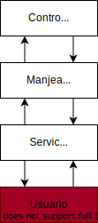

# Descripción de la aplicación (información necesaria para entender la aplicación)

## Descripción de la solución

La solución consiste en ... 

## Drivers que orientan la toma de decisiones para la solución propuesta
**Nota**: Describir solo los drivers que orientan la toma de desiciones

* Funcionalidad
  * Presición:
  * Adecuado:
  * Interoperabilidad:
  * Conformidad:
  * Seguridad:
* Fiabilidad
  * Madurez:
  * Tolerante a errores:
  * Recuperabilidad:
* Usabilidad
  * Comprensibilidad:
  * Aprendibilidad:
  * Operatibidad:
  * Atractividad:
* Eficiencia
  * Tiempo de respuesta:
  * Recursos:
  * Utilización:
* Mantenibilidad
  * Analizable:
  * Cambiable:
  * Estabilidad:
  * Comprobable:
* Portabilidad
  * Adaptabilidad:
  * Instalabilidad:
  * Co-existencia:
  * Reemplazable:
  
## Solución

* Usuario
  ## Diagrama de solución
  
  | Elemento        | Descripción |
  | :----           | :---        | 
  | Constolador     |             |  
  | Servicio        |             |
  | Manejador       |             |